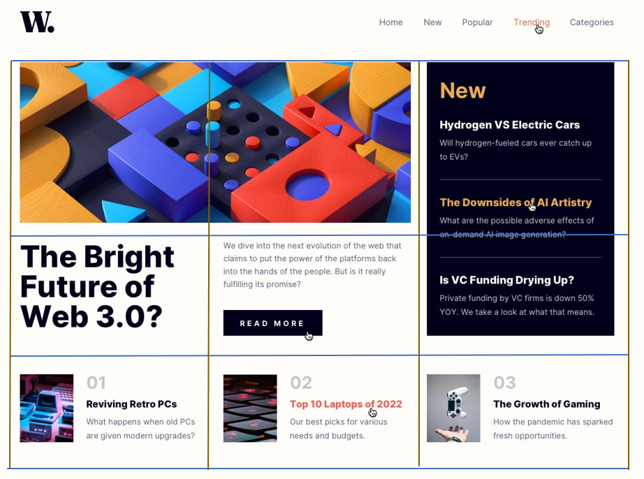

# News homepage solution


## Table of contents

- [Overview](#overview)
  - [The challenge](#the-challenge)
  - [Screenshot](#screenshot)
- [My process](#my-process)
  - [Built with](#built-with)
  - [What I learned](#what-i-learned)
  - [Continued development](#continued-development)
- [Author](#author)

**Note: Delete this note and update the table of contents based on what sections you keep.**

## Overview

### The challenge

Users should be able to:

- View the optimal layout for the interface depending on their device's screen size
- See hover and focus states for all interactive elements on the page

### Screenshot



## My process

### Built with

- Semantic HTML5 markup
- CSS custom properties
- Flexbox
- CSS Grid

### What I learned

- Learnt about the importance of semantics when it comes to building webpages
- Gained exposure to some new HTML tags such as the <picture>:

```html
    <picture>
        <source media="(min-width:1440px)" srcset="./assets/images/image-web-3-desktop.jpg" alt="Puzzle">
        <source media="(min-width:375px)" srcset="./assets/images/image-web-3-mobile.jpg" alt="Puzzle">
        
    </picture>
```
- Experimented with media queries and their role in responsive designs:

```css
@media screen and (max-width:950px){
    ...
}
```


### Continued development

In future work, I would like to start building webpages with a mobile-first approach. I, also, aim to spend more time focusing on media queries to
accommodate for different viewports and maximise the responsivity of my webpages.


## Author

- LinkedIn - [Mario Tawfelis](https://www.linkedin.com/in/mariotawfelis/)
